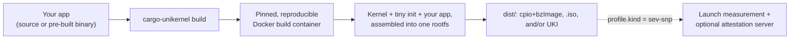

# cargo-unikernel

[](https://crates.io/crates/cargo-unikernel)
[](https://docs.rs/cargo-unikernel)
[](#license)
[](#minimum-supported-rust-version)

> **0.0.1, pre-release.** The config schema, CLI flags, and generated GitHub Actions workflow
> can all still change between versions without warning. If you need something stable to
> depend on today, wait for a 0.1 tag or pin an exact version and re-verify on upgrade —
> `project.cargo_unikernel_version` in `cargo-unikernel.toml` exists specifically to make that
> upgrade a deliberate, re-verified step rather than a silent one.

```sh
cargo install cargo-unikernel --locked
cd my-server/
cargo unikernel build
```

`--locked` pins every dependency to what's in this crate's own `Cargo.lock`, so two installs
of the same `cargo-unikernel` version always resolve to the exact same build — without it,
`cargo install` re-resolves dependency versions against whatever's newest on crates.io right
now, which can silently vary between two installs of the same version.

That's it — no config file, no separate repo, no template to fork. `cargo install` puts a
`cargo-unikernel` binary on `PATH`, and Cargo's own external-subcommand convention (the same
mechanism behind `cargo clippy`, `cargo fmt`, `cargo audit`, ...) picks it straight up, so
`cargo unikernel <command>` just works. (`cargo-unikernel <command>` works identically, if
calling the binary directly is preferred.) It drops into any project and turns it into a
minimal, hardened, bootable unikernel image: no OS bloat, no shell, no package manager,
nothing running except your app (and, optionally, a remote attestation endpoint). Pick
`.iso`, `.cpio`+kernel, UKI, or the raw app binary as output, with an optional AMD SEV-SNP
confidential-computing profile.

**Any language works.** Rust is the default and the most polished path — zero-config,
compiles straight from your `Cargo.toml` with no extra setup. But the tool doesn't assume
Rust: bring a pre-built binary in any language/runtime with zero build-time trust decisions,
or point it at a build command (Go, Zig, C, whatever produces a static binary) and it
compiles from source the same reproducible way Rust does. See [Bringing your app
in](#bringing-your-app-in) below for the three options side by side.

## What it is

A unikernel image produced by `cargo-unikernel` is a Linux kernel, a tiny init binary, and
one application binary, packed together with nothing else. There is no distribution layered
on top of the kernel: no systemd, no bash, no coreutils, no package manager, no SSH daemon,
no dynamic linker. The init process mounts a handful of filesystems, applies kernel/network
hardening, execs the app as an unprivileged child, watches it, and powers the machine off the
moment anything looks wrong. That's the entire runtime surface — see [How it
works](#how-it-works) below and [`docs/architecture.md`](docs/architecture.md) for the full
boot sequence.

## Why this over a container or a hand-built VM image

The obvious alternative is a container (Docker/OCI) on a shared kernel, or a hand-rolled VM
image built from a general-purpose distro. Both still carry a shell, a package manager, and a
dynamic linker an attacker can pivot to after a compromise — `cargo-unikernel` strips those
out entirely rather than trying to lock them down. That trade goes against you too: no shell
means no live debugging by attaching to the running instance, no package manager means you
can't patch a dependency without rebuilding, and the filesystem is RAM-only, so there is
nowhere local for state to durably live across a reboot (see [Is cargo-unikernel right for
your app?](#is-cargo-unikernel-right-for-your-app) below for the full list of what this rules
out).

In exchange:

### Performance

Nothing else ever runs on this kernel. There's no container runtime, no cron, no log-shipping
agent, no monitoring daemon, no other tenant's process competing for the scheduler or the
CPU cache — every cycle and every byte of RAM the VM has belongs to the app. On top of that,
the kernel itself is tuned for exactly this single-workload shape rather than for
general-purpose multitasking: `CONFIG_PREEMPT_NONE` (there's nothing else to preempt for),
BBR TCP congestion control, opt-in transparent hugepages, and a boot sequence that polls for
network readiness instead of sleeping for a worst-case timeout. The image itself is small —
a bare kernel, a small init, and the app — so boot is fast, which matters for anything that
scales up and down rather than staying resident forever. See
[`docs/architecture.md`](docs/architecture.md#kernel-cmdline-rationale) for the exact flags
and the reasoning behind each one.

### Security

The threat model here is **zero trust in the OS**, because there effectively isn't one to
trust: no shell to pivot to after a compromise, no package manager to pull in a second-stage
payload, no dynamic linker or shared libraries for an attacker to hijack. The rootfs is
read-only after boot, every other writable mount is `noexec` by default, the app's capability
bounding set is dropped to empty before it ever runs, a mandatory seccomp filter permanently
blocks `ptrace`, kernel-module loading, `mount`/`kexec`/`reboot`, and a handful of other
post-exploitation syscalls, and `setrlimit` ceilings contain a compromised or buggy app's own
resource use. None of this is opt-in configuration to remember to enable — it's the default
shape of the image. A full break-down of what's defended against, attack by attack, lives in
[`docs/threat_model.md`](docs/threat_model.md).

### Confidential computing (AMD SEV-SNP)

Set `profile.kind = "sev-snp"` and the same image gets a hardware root of trust: AMD's
Secure Processor measures the kernel, init, and app before any of it executes, guest memory
is encrypted with a hardware-derived per-VM key, and an optional in-guest attestation server
proves to a remote party that this exact measured image — not a tampered one — is what's
running right now. This moves the cloud provider, the hypervisor, and anyone with physical
access to the host outside the trust boundary. See [Confidential computing
(SEV-SNP)](#confidential-computing-sev-snp) below and
[`docs/threat_model.md`](docs/threat_model.md) for the full trust-boundary diagram.

## How it works



Your project directory is mounted straight into a pinned build container — nothing is cloned
or copied for a local build. Inside that container: the kernel is built from a pinned source
with a curated hardening profile, the app is compiled (or, for a pre-built binary, verified
and staged) and checked to confirm it's statically linked, the guest init is cross-compiled
alongside it, and everything is assembled into a rootfs and packed into whichever output
formats were requested. Everything the build needs beyond your own project — the Dockerfile,
the kernel build script and Kconfig fragments, the ISO/UKI tooling, and the guest init's own
source — is embedded directly inside the `cargo-unikernel` binary itself, so `cargo install
cargo-unikernel` really is the whole install: nothing to clone, nothing to keep in sync with
a separate template repo.

For the full pipeline stage by stage, the guest boot sequence, and the reasoning behind each
kernel cmdline flag, see [`docs/architecture.md`](docs/architecture.md).

## Is cargo-unikernel right for your app?

Not every app can be turned into a unikernel this way. The build enforces a few hard
requirements, so it's worth checking these before committing to the tool:

- **A fully static `x86_64-unknown-linux-musl` binary.** The build fails immediately (naming
  the missing libraries) if the app binary has a dynamic linker segment or any `DT_NEEDED`
  dependency — the rootfs never contains a dynamic linker or any shared library. Rust's
  default target already produces this; other languages need to opt into static linking
  (`CGO_ENABLED=0` for Go, `-Dtarget=x86_64-linux-musl` for Zig, `cc -static` for C). See
  [Bringing your app in](#bringing-your-app-in).
- **x86_64 only, today.** The kernel, the musl target, and (for the confidential-computing
  profile) AMD SEV-SNP itself are all x86_64-specific.
- **No durable local disk state.** The entire filesystem is RAM-only (tmpfs/initramfs); a
  reboot starts fresh from the measured image every time, and nothing durably persists
  locally across restarts. State that needs to survive belongs somewhere else — object
  storage, an external database, an upstream queue.
- **Everything the app needs has to already be in the binary at build time.** There's no
  package manager and no shell to install anything at runtime, and the guest never fetches
  the app itself over the network — it's baked into the image before the image is ever
  measured or booted.
- **A single embedded app binary**, though it's free to be internally multi-threaded or
  multi-process (ordinary `fork`/`clone`/`execve` are untouched by the seccomp filter) — a
  default `#[tokio::main]` runtime or an app that forks worker processes both work fine.

None of this is exotic for the kind of workload the tool targets — it mirrors how a
well-behaved container image should already be built — but it does rule some things out.

**Best fits:**

- Standalone web/API servers and network-facing services — the performance and security
  properties above matter most exactly here.
- Anything that's RAM-only by nature: caches, stream/event processors, ephemeral compute,
  request-scoped workloads with no precise state to preserve between restarts.
- Apps where all persistent state already lives off-box (object storage, a managed database,
  a queue), so "the filesystem resets every boot" is a non-issue rather than a limitation.
- Anything that already ships as a single self-contained static binary, or can be made to —
  no runtime dependency fetching, no install step.
- Confidential-computing workloads that need the infrastructure operator — cloud provider,
  hypervisor admin, anyone with physical access to the host — outside the trust boundary.

**Not a good fit:**

- Apps that expect a full OS environment at runtime: shelling out to system tools, cron,
  multiple cooperating system daemons, systemd units.
- Anything that can't be statically linked, or that dynamically loads plugins/shared objects
  at runtime.
- Non-x86_64 targets.
- Databases or other software that depends on durable local disk state surviving a reboot.
- GUI applications, or anything needing a display server.

## Bringing your app in

Not a Rust project, or want more control? Three ways to get the app into the image, from
least to most setup:

| | How it works | Trust model | Setup |
|:---|:---|:---|:---|
| **Rust source build** | `cargo build`, cross-compiled to musl | Compiler never sees pre-built bytes | Zero-config, or `toolchain = "rust"` |
| **Generic source build** | A `build_command` runs in the same reproducible container | Same as Rust — nothing pre-built ever touches the image | `toolchain = "generic"` + `build_command`/`output_binary` |
| **Bring your own binary** | A local file — never fetched over the network | Trust whatever produced the binary | `[app.binary]` |

The first two ("Mode A", compile from source) are functionally the same pipeline with a
different last-mile build step — see `examples/cargo-unikernel.casual.toml`'s `[app.source]`
section for a worked Go example (static binary, no dynamic libc). The third ("Mode B") works
with literally anything, at the cost of trusting pre-built bytes instead of verifying a
build. [`docs/toolchains.md`](docs/toolchains.md) goes through the trade-offs in more depth.

## Customizing with cargo-unikernel.toml

The zero-config path always builds the `casual` profile with the Rust toolchain. To choose
SEV-SNP, switch to a generic build command, pick specific output formats, use a pre-built
binary, or tune hardening, scaffold a config:

```sh
cargo-unikernel init # writes ./cargo-unikernel.toml
nano cargo-unikernel.toml
cargo-unikernel build
```

`cargo-unikernel init --profile <casual|sev-snp>` picks which starting point to scaffold.
See `examples/cargo-unikernel.casual.toml` and `examples/cargo-unikernel.sev-snp.toml` —
each is a fully-commented starting point that documents every app-acquisition mode
(Rust source, generic source, or a pre-built binary) inline.

## Granular control: kernel version, hardening, and caching

Every knob is exposed and exhaustively documented inline in the example configs — open
`examples/cargo-unikernel.casual.toml` for the full reference (every field, its type,
allowed values, and default). The highlights:

- **`[kernel]`**: pin the exact Linux kernel `version` to build (and optionally its
  `sha256`).
- **`[hardening.kernel]`**: named build-time (Kconfig) toggles — legacy subsystems,
  debug interfaces, KSPP self-protection + Lockdown LSM, exploit mitigations, seccomp — each
  on by default, each independently toggleable, chosen to cost as little performance as
  possible for the security they buy (see [`docs/architecture.md`](docs/architecture.md)'s
  hardening notes for the specific trade-offs made, e.g. why the seccomp-friendly BPF JIT
  stays enabled while unprivileged BPF loading doesn't).
- **`[hardening.runtime]`**: named boot-time (sysctl) toggles — network spoofing
  protection, ICMP hardening, TCP hardening (+ a keep-alive throughput tweak), info-leak
  restriction, ptrace/BPF restriction (+ JIT hardening), kexec/filesystem protection — same
  default-on, independently toggleable shape.
- **`extra_sysctls`/`extra_kernel_config`**: raw escape hatches for exact, per-flag control
  beyond the curated categories above.
- **`[attestation]`**: omit this section (or set `enabled = false`) and the guest init
  doesn't even compile the attestation server's code — smaller binary, fewer moving parts, if
  remote attestation isn't needed. When it is compiled in, it adds no third-party
  dependencies: the server is plain blocking sockets over `libc`, not an async runtime. See
  [`docs/attestation_api.md`](docs/attestation_api.md) for the wire protocol.
- **Always on, not configurable**: a seccomp denylist permanently blocking `ptrace`, kernel-
  module loading, `mount`/`kexec`/`reboot`, and a handful of other syscalls with no
  legitimate use in a single-purpose server — the app process is killed immediately on any
  attempt, which the existing watchdog turns into a full VM reboot. Ordinary threads and
  child processes are unaffected. The app's capability bounding set is also unconditionally
  dropped to empty before exec (defense-in-depth beyond the uid/gid drop below — nothing in
  this image ever execs a capability-holding process). See
  [`docs/architecture.md`](docs/architecture.md).
- **`[app.runtime.limits]`**: `setrlimit` ceilings (`max_open_files`, `max_processes`,
  `max_memory_mb`) applied to the app's process before exec — contains a compromised or buggy
  app forking itself into a fork bomb, exhausting file descriptors, or growing unboundedly in
  memory. All optional, with generous built-in defaults (65536 files, 2048 processes, no
  memory cap) that ordinary workloads shouldn't hit.
- **`[app.runtime.danger]`**: everything here is off by default and named to be hard to
  enable by accident. `allow_write_execute` is the one opt-out from "no writable+executable
  path anywhere in the guest" — only turn it on if the app genuinely needs to write and run
  new code at runtime.

**Caching.** The Linux kernel source tarball (~150MB) and, for a given kernel
version+hardening config, the *compiled* bzImage are both cached under
`~/.cache/cargo-unikernel/` — change your app code or output formats and the kernel step is
skipped entirely; change a hardening toggle or kernel version and only that gets rebuilt.
`ccache` covers the compiler invocations for everything else. `cargo-unikernel github init`'s
generated workflow caches this same directory (plus the cargo install itself) across CI runs
via `actions/cache` — and, since GitHub Actions cache scopes are isolated per tag (a cache
from one release can never be reused by another), also builds on every push to `main` so a
warm cache actually exists for tag-triggered releases to inherit; see [CI/CD via GitHub
Actions](#cicd-via-github-actions) below for what this means for build time.

**Clean output.** `dist/` (or wherever `[output].dir` points) only ever contains the actual
build artifacts requested — the generated in-container build script and other internal
scratch files live under `~/.cache/cargo-unikernel/last-build/` instead, out of the way,
but still there to inspect if a build fails.

## Why build-time embedding

The app binary is compiled/verified and baked into the image **at build time**, never
fetched by the guest over the network at boot. That means no runtime network dependency for
the app to start, no signing-key management, no time-of-check/time-of-use gap — and for
SEV-SNP builds, the launch measurement already deterministically covers the exact app
bytes, because measuring the image *is* measuring the app. The guest-side init is
intentionally tiny: mount filesystems, apply kernel/sysctl hardening, exec the app as an
unprivileged child, watch it, and power off immediately if anything looks wrong. See
[`docs/init_security.md`](docs/init_security.md) for the full rationale.

## CLI

- `cargo-unikernel build` — build the image(s); zero-config or from a config file.
- `cargo-unikernel init` — scaffold a `cargo-unikernel.toml` when customization is needed.
- `cargo-unikernel measure` — recompute the SEV-SNP launch measurement from already-built
  artifacts without a full rebuild (`sev-snp` profile only).
- `cargo-unikernel doctor` — check the host toolchain (Docker, git, gh).
- `cargo-unikernel github init` — write `.github/workflows/cargo-unikernel.yml`, so a tag
  push (any `v*` tag) builds and publishes a GitHub Release with the built image,
  automatically. See [CI/CD via GitHub Actions](#cicd-via-github-actions) below.
- `cargo-unikernel release` — build (unless `--no-build`) and publish a GitHub Release with
  the built artifacts right now, via the `gh` CLI — the one-call path `github init`'s
  workflow also uses under the hood. Which artifacts get attached and the release's
  title/notes/draft/prerelease flags are configurable via an optional `[release]` section
  in `cargo-unikernel.toml`; see `examples/cargo-unikernel.casual.toml` for every knob.

## CI/CD via GitHub Actions

`cargo-unikernel github init` writes a complete release workflow: on every `v*`-matching tag
push, it installs `cargo-unikernel`, builds, and publishes the result as a GitHub Release. It
also builds (never publishes) on every push to `main`, purely to keep the cache warm — see
**Caching** above for why that matters for tag-triggered releases specifically. The tag glob
is `v*`, not a strict `vX.Y.Z` semver check, so any tag starting with `v` triggers it.

If the config passed to `github init` (`--config`, default `cargo-unikernel.toml`) pins
`project.cargo_unikernel_version`, the generated workflow installs that exact version
(`cargo install cargo-unikernel --version <pinned> --locked`) instead of whatever's newest —
CI builds with the same CLI version the config was written against, and `cargo-unikernel
build` still fails closed (`ValidationError::ToolVersionMismatch`) if a different version
ever ends up running against it anyway (e.g. a stale cache). Re-run `github init` after
pinning or changing the version, once the old workflow file is deleted, to pick it up.

> [!IMPORTANT]
> **The first build in a fresh environment compiles a complete Linux kernel from source
> inside the pinned container, and that takes a while — expect around 25 minutes.** This is
> normal, not a hang or a misconfiguration: it's a real kernel build, not a cache miss on
> something small. Every build after that, in CI or locally, shares the kernel source and
> compiled-bzImage cache described above and typically finishes in a few minutes, as long as
> the kernel version and hardening config haven't changed.

Pass `--attest-provenance` to also add a GitHub build-provenance attestation step
(`actions/attest-build-provenance`) for the published artifacts — a Sigstore-backed,
GitHub-verifiable proof that this exact workflow run, from this exact commit, produced these
exact bytes (`gh attestation verify <file> --repo <owner>/<repo>`). Off by default: it
requires granting the workflow `id-token: write`/`attestations: write`, so it's opt-in
rather than assumed. (This is a supply-chain provenance attestation via GitHub's own
Sigstore-backed infrastructure — a different thing from this project's own `[attestation]`
section, which is AMD SEV-SNP hardware remote attestation of a *running* guest.)

## Confidential computing (SEV-SNP)

Set `profile.kind = "sev-snp"` and a `[sev_snp]` section (`vcpus`, `vcpu_type`,
`kernel_cmdline`). sev-snp also requires `project.cargo_unikernel_version` to be set (the
only profile where it's mandatory, not optional) — a different CLI version can bundle a
different pinned kernel/Dockerfile, which would silently change the launch measurement
otherwise; `cargo-unikernel build`/`measure` refuse to run unpinned, or under a different
version than the one pinned. `cargo-unikernel init --profile sev-snp` sets this
automatically. `cargo-unikernel build` will then:

1. Build the kernel with the SEV-SNP guest-attestation Kconfig fragment layered on top of
   the universal hardening baseline.
2. Compute the launch measurement with `virtee/sev-snp-measure`, using *exactly* the vcpu
   count/type and kernel cmdline configured — the same cmdline is baked into the UKI's
   `.cmdline` section, so what's measured and what boots can never drift.
3. Write `dist/sev_measurement.txt` (the raw measurement) and `dist/sev_measurement.json`
   (a sidecar recording every input that produced it, plus a `component_sha256` block —
   individual sha256 hashes of the kernel, the cpio, the raw app binary, `cargo-unikernel-
   init`, and the OVMF firmware used — so two builds that produced different measurements
   can be diffed component-by-component instead of only knowing the final hash differs).
4. Optionally enable the remote-attestation server (`[attestation]`) — see
   [`docs/attestation_api.md`](docs/attestation_api.md) for its request/response format and
   how a remote party verifies a report.

**Bring your own OVMF.** By default, `preset = "builtin"` uses the AMD SEV-SNP firmware baked
directly into the `cargo-unikernel` binary itself — hash-pinned, never fetched over the
network at build time (see [`docs/reproducible_builds.md`](docs/reproducible_builds.md)).
Different cloud providers ship different OVMF/UEFI firmware builds for SEV-SNP, though, so
`[sev_snp.ovmf]` also accepts a local `path` to firmware the provider supplied — always a
local file, never a URL. See `examples/cargo-unikernel.sev-snp.toml`.

For sev-snp, build via a tagged release workflow (`cargo-unikernel github init`) so the
measurement corresponds to an immutable, inspectable commit rather than whatever's
uncommitted on disk. ISO output is available for sev-snp builds too, as a convenience/testing
image — the artifact that's actually measured is the cpio+bzImage (or UKI) pair, and a
benign `xorriso ... WARNING: EFI boot equipment is
provided but no directory /EFI/BOOT` may appear during ISO builds specifically — see
[`docs/architecture.md`](docs/architecture.md)'s note on it if that looks alarming the first
time.

## Minimum supported Rust version

**This crate requires Rust 1.88 or newer** — the config-validation code relies on `if let`
chains, stabilized in 1.88. This is the version needed to build `cargo-unikernel` itself; it
has no bearing on your app's own toolchain, which is pinned independently inside the build
container (see [`docs/reproducible_builds.md`](docs/reproducible_builds.md)). Bumping the
MSRV is a minor-version change, not treated as a breaking one, while the crate stays pre-1.0.

## Project layout (this repo — building cargo-unikernel itself)

```
Cargo.toml    the published CLI crate itself — `cargo install cargo-unikernel`
src/          CLI, config schema, build pipeline
assets/       Dockerfile, kernel build script + Kconfig, ISO script,
              baked-in SEV-SNP OVMF firmware — embedded into the binary
guest/        SEPARATE nested workspace: cargo-unikernel-init (the
              guest PID-1) + cargo-unikernel-common (shared mount/
              hardening logic). Not a Cargo dependency of the CLI —
              only ever embedded as source text, cross-compiled inside
              the build container for every user's build.
examples/     fully-commented starting configs for each profile x
              app-acquisition mode (rust source / generic source /
              pre-built binary)
docs/         architecture, toolchain trade-offs, threat model,
              reproducible-builds notes
```

## Documentation

Start at [`docs/README.md`](docs/README.md) for the full index and suggested reading paths
depending on what's being evaluated. Direct links:

- [`docs/architecture.md`](docs/architecture.md) — how the pieces fit together: host CLI,
  build container, guest init, boot sequence, kernel cmdline rationale.
- [`docs/toolchains.md`](docs/toolchains.md) — the three ways to bring an app in, compared.
- [`docs/threat_model.md`](docs/threat_model.md) — what is and isn't defended against under
  each profile.
- [`docs/reproducible_builds.md`](docs/reproducible_builds.md) — the determinism story, and
  how to verify a build independently.
- [`docs/attestation_api.md`](docs/attestation_api.md) — the remote-attestation HTTP server's
  wire protocol and how to verify a report.
- [`docs/init_security.md`](docs/init_security.md) — why the guest embeds the app at build
  time instead of fetching it at runtime, and what security machinery the init runs.

## License

Licensed under either of

- [Apache License, Version 2.0](LICENSE-APACHE)
- [MIT license](LICENSE-MIT)

at your option.

Unless you explicitly state otherwise, any contribution intentionally submitted for inclusion in
this crate, as defined in the Apache-2.0 license, shall be dual licensed as above, without any
additional terms or conditions.
