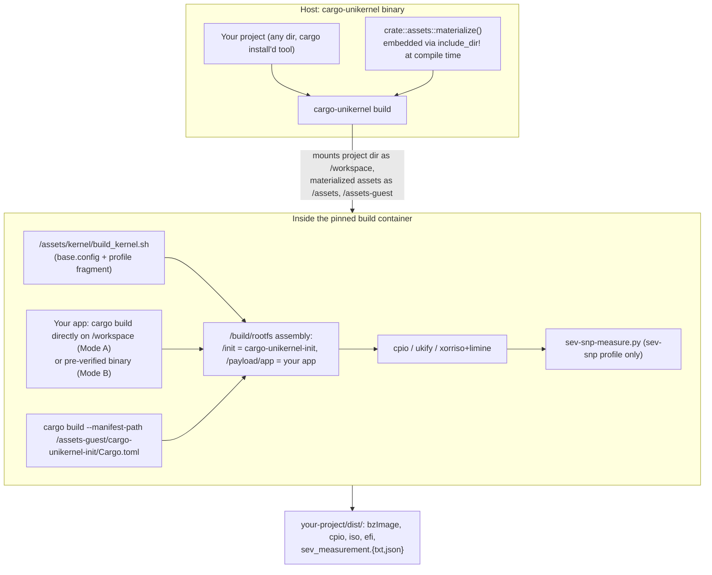

# Architecture

*[docs index](README.md) · [project README](../README.md)*

`cargo-unikernel` publishes as a **single crate** (`cargo install cargo-unikernel`) that
drops into any project. There is **no traditional Linux distribution** in the built image —
no systemd, no bash, no SSH, no package manager. Just a hardened kernel, a tiny init binary,
and your app. Everything the build needs beyond your own project — Dockerfile, kernel build
script + Kconfig, ISO/UKI tooling, the guest init's source — is embedded in the published
binary, so the tool works from any directory after a plain `cargo install`.

## Repo layout

- **`src/`** — the CLI crate. `schema.rs`: config schema + validation. `pipeline/`:
  app-source resolution, the Docker container, image formats, SEV-SNP measurement.
  `assets.rs`: embeds `assets/`+`guest/` via `include_dir!`, materializes to
  `~/.cache/cargo-unikernel/` on first use.
- **`assets/`** — Dockerfile, kernel build script + Kconfig, ISO build script, the two pinned
  OVMF firmware binaries. Mounted read-only as `/assets`.
- **`guest/`** — a separate, nested Cargo workspace: `cargo-unikernel-init` (guest PID 1) +
  `cargo-unikernel-common` (mount/hardening/entropy/seccomp). Not a Rust dependency of the
  CLI — only its source text is embedded and cross-compiled per build. Its own workspace so
  it builds/tests standalone (`cd guest && cargo build`); dependency graph is `libc` alone.

## Boot sequence (guest init)

The app is already embedded at build time, so the sequence is short:

1. `mlockall` — lock all pages, no swap.
2. Mount `/proc`, `/sys`, `/dev`, `/tmp`+`/var` (noexec unless
   `[app.runtime.danger].allow_write_execute`), `/run`, `/payload`. `/var` is tmpfs unless
   `[storage].mode = "persistent"`, in which case it's the virtio-blk device, formatted ext4
   on first use (a device whose superblock doesn't carry this tool's volume label is wiped
   rather than mounted — the check reads the raw device, before the kernel's ext4 driver sees
   it), then `chown`'d to the app's uid/gid.
3. Bring up loopback + admin-down interfaces, apply sysctl hardening for whatever's enabled.
4. Wait for kernel entropy, then poll (up to 30s) for a default route — skipped when
   `[network].mode = "none"`.
5. Remount `/payload` read-only and `/tmp`/`/run` back to noexec (unless
   `allow_write_execute`); `/var` is never remounted. This happens before the app exists, so
   there is no window in which a running app faces a still-writable payload mount.
6. `exec` the app as an unprivileged child. Before `execve`, in order: apply `setrlimit`
   ceilings from `[app.runtime.limits]` (raising one above the kernel default needs
   `CAP_SYS_RESOURCE`, so this runs before the capability drop below removes it); drop the
   capability bounding set (`PR_CAPBSET_DROP`, while still root — dropping it needs
   `CAP_SETPCAP`); clear supplementary groups and `setgid`/`setuid` to the configured
   uid/gid; install a mandatory classic-BPF seccomp denylist (gated on the x86_64 syscall
   ABI, then permanently blocking `ptrace`, kernel-module loading, both mount APIs —
   `mount(2)` and `fsopen`/`fsmount`/`move_mount` — `kexec`/`reboot`, keyring syscalls,
   `open_by_handle_at`, clock-setting syscalls, and `memfd_create`/`memfd_secret` unless
   `allow_write_execute` is set. Ordinary `clone`/`fork`/`execve` is untouched; namespace
   creation via `clone` is blocked by `CONFIG_NAMESPACES=n` instead).
7. On sev-snp builds, `/dev/sev-guest` (if present) opens to both the app and the attestation
   server.
8. If `[attestation].enabled` (sev-snp only): re-exec as an isolated, unprivileged
   `run-attestation-server` child through the same privilege-drop sequence, serving SNP
   reports on `[attestation].port` over plain blocking sockets. See
   [`attestation_api.md`](attestation_api.md).
9. PID 1 watchdog loop: any child death or earlier failure triggers immediate power-off — the
   system never lingers in a degraded state.

## Build pipeline (host)

`cargo-unikernel build` (`src/pipeline/`):

1. **Config resolution** — explicit `-c`, else `./cargo-unikernel.toml`, else zero-config
   auto-detection (`Cargo.toml` → casual Mode A `path="."`; `--binary <path>` → Mode B).
2. **`app_source`** — resolves `[app]` into a `LocalSource` (`path`, confirming a
   `Cargo.toml` is there) or a verified binary (Mode B).
3. **`ovmf`** (sev-snp only) — resolves `[sev_snp.ovmf]`, stages non-preset firmware into
   `dist/.ovmf-cache/` host-side.
4. **`docker`** — builds `Dockerfile.reproducible`, runs one generated in-container script:
   builds the kernel, builds the app (`"rust"` → `cargo build`; `"generic"` → your
   `build_command`), then cross-compiles `cargo-unikernel-init` (app build first, so its
   sha256 bakes into the init via `build.rs`). `readelf` then checks `$APP_BIN` for dynamic
   linking regardless of mode, failing the build with missing-library names rather than
   shipping a crash-looping image — see [`toolchains.md`](toolchains.md). The pipeline then
   assembles the rootfs/cpio and produces every requested output format.
5. **`image::{cpio,iso,uki}`** — every format is produced inside the container; this just
   confirms it landed in `dist/` and reports it.
6. **`measurement`** (sev-snp only) — reads `dist/sev_measurement.txt`, writes a JSON sidecar
   recording every input (vcpus, cmdline, kernel/initrd identity, OVMF source).

Shells out to pinned tools (`ukify`, `xorriso`+Limine, `sev-snp-measure.py`) rather than
reimplementing PE/ISO assembly or kernel measurement.

## GitHub integration

- **`cargo-unikernel github init`** writes a workflow that, on every `v*`-glob tag push, installs
  `cargo-unikernel`, builds, then `release --tag <tag> --no-build`. The same build also runs
  (build-only) on pushes to `main`, keeping a warm `actions/cache` entry available since
  cache scopes are otherwise isolated per tag. `--attest-provenance` adds a Sigstore-backed
  `actions/attest-build-provenance` step, gated to tag pushes — build-provenance attestation
  of the release artifacts (distinct from SEV-SNP's `[attestation]`, which attests a
  *running guest*). Off by default.
- **`cargo-unikernel release`** builds (unless `--no-build`) and publishes `dist/` via `gh` —
  the same path the generated workflow uses. What's attached and the release
  title/notes/draft come from `[release]`, so editing it changes both local and CI releases.

## Image formats

| Format | Tooling | Notes |
|:---|:---|:---|
| `.cpio` + `bzImage` | `cpio --reproducible`, zeroed timestamps, `LC_ALL=C sort` | The measured path for sev-snp; most direct for QEMU. |
| `.iso` | `xorriso -as mkisofs` + Limine | Hybrid BIOS+UEFI; Limine over GRUB for a smaller trusted codebase. Convenience-only for sev-snp — not what's measured. |
| UKI (`.efi`) | `systemd-ukify` | Single UEFI-bootable PE; cmdline shared with `sev-snp-measure.py`. |
| `binary` (`.bin`) | plain `cp` of `$APP_BIN` | Raw app binary alongside any other requested formats. |

`assets/scripts/make_iso.sh` takes the cmdline as an argument so every format from one build
boots with exactly the same cmdline — one source of truth, no drift. See
[`reproducible_builds.md`](reproducible_builds.md) and [`threat_model.md`](threat_model.md)
for the determinism and threat stories.

## Kernel cmdline rationale

Every flag earns its place, in either direction:

| Flag | Why included |
|:---|:---|
| `quiet` | Suppresses routine boot chatter on the serial console; `loglevel=3` below still lets failures through. |
| `loglevel=3` | A boot failure prints to serial instead of failing silently. |
| `panic=-1` | Reboots on kernel panic instead of hanging — extends the init's watchdog to the kernel level. |
| `random.trust_cpu=on`, `random.trust_bootloader=off` | Trust the CPU's hardware RNG; don't trust bootloader/firmware handoff. |
| `page_alloc.shuffle=1` | Activates page-allocator shuffling, which the kernel otherwise leaves inert on a VM with no memory-side-cache to detect. |
| `lockdown=integrity`/`confidentiality` | Lockdown LSM; `confidentiality` (sev-snp) adds no-raw-`/dev/mem`/no-MSR-writes at no extra cost. |
| `transparent_hugepage=madvise` | Opt-in per allocation — avoids the kernel's `always` compaction overhead while keeping the win for large heaps/JITs; no security trade-off, so it's a default. |
| `init_on_alloc=1`, `init_on_free=1` | Zeroes kernel heap memory on allocation and free, closing use-after-free/uninitialized-read info leaks; small, well-understood cost for a security-first default. |

`CONFIG_PREEMPT_NONE` and `CONFIG_TCP_CONG_BBR` (Kconfig, not cmdline) give the same
no-security-cost throughput wins.

**Deliberately excluded:** `mitigations=auto,nosmt`/explicit `spectre_v2=`/etc. (redundant
with the kernel's own safe default; `nosmt` costs 30-50% throughput for little gain in a
single-tenant VM); `mitigations=off` (not exposed as a config knob — use
`extra_kernel_config` if you really need it); `pti=on` (already default); `fips=1`
(compliance opt-in, add yourself if needed); `amd_iommu=*`/`iommu.*` (SEV-SNP's DMA
protection is the hardware Reverse Map Table, not a vIOMMU that isn't there).

**A warning you'll see and can ignore:** every ISO build prints `xorriso ... WARNING: EFI
boot equipment is provided but no directory /EFI/BOOT`. Expected — `make_iso.sh` embeds the
EFI boot image via a real El Torito boot catalog entry (Limine's documented recipe) instead
of a `/EFI/BOOT/BOOTX64.EFI` file; UEFI firmware still finds it as a proper ESP either way. A
literal `/EFI/BOOT` tree would silence the warning but produce an ISO nothing can boot.
