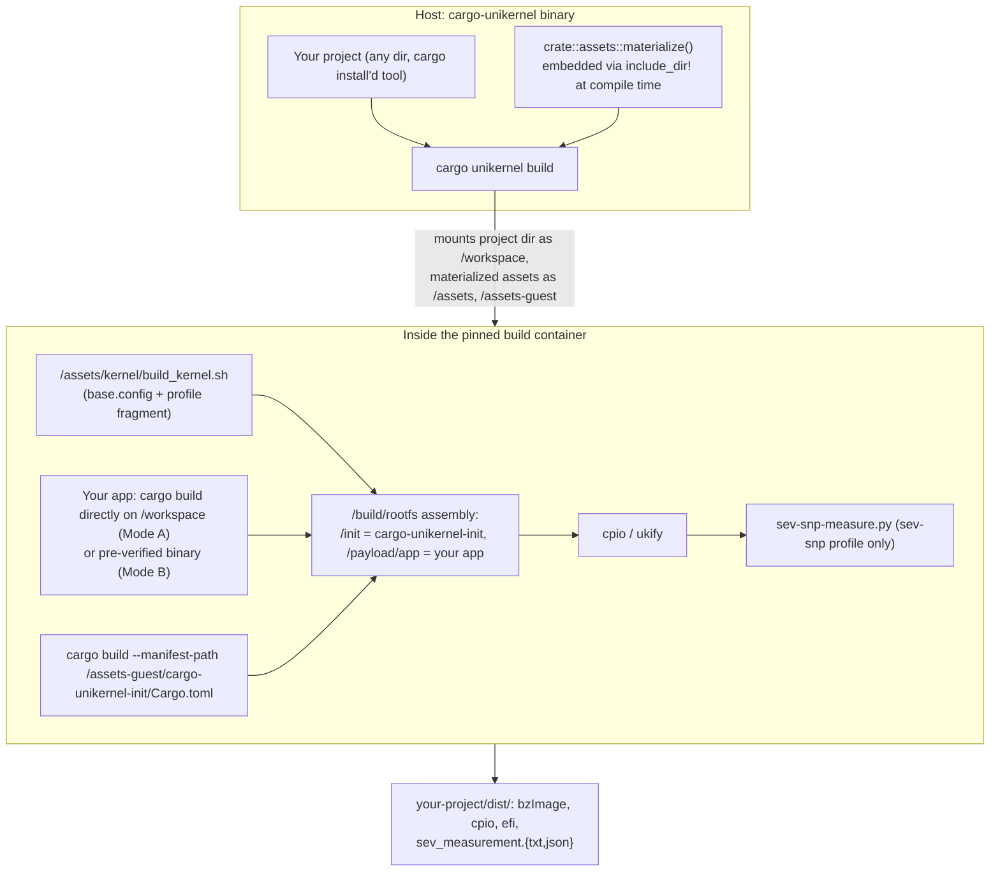

# Architecture

*[docs index](README.md) · [project README](../README.md)*

`cargo-unikernel` publishes as a **single crate** (`cargo install cargo-unikernel`) that
drops into any project. The built image has **no traditional Linux distribution** — no
systemd, no bash, no SSH, no package manager. Just a hardened kernel, a tiny init binary, and
your app. Everything the build needs beyond your own project — Dockerfile, kernel build
script + Kconfig, UKI tooling, the guest init's source — is embedded in the published
binary, so the tool works from any directory after a plain `cargo install`. Need a bootable
ISO? See [`docs/building_an_iso.md`](building_an_iso.md) for assembling one yourself from a
`cpio`+`bzImage` or `uki` build.



## Repo layout

- **`src/`** — the CLI crate. `schema.rs`: config schema + validation. `pipeline/`:
  app-source resolution, the Docker container, image formats, SEV-SNP measurement.
  `assets.rs`: embeds `assets/`+`guest/` via `include_dir!`, materializes to
  `~/.cache/cargo-unikernel/` on first use.
- **`assets/`** — Dockerfile, kernel build script + Kconfig, the two pinned OVMF firmware
  binaries. Mounted read-only as `/assets`.
- **`guest/`** — a separate, nested Cargo workspace: `cargo-unikernel-init` (guest PID 1) +
  `cargo-unikernel-common` (mount/hardening/entropy/seccomp). Not a Rust dependency of the
  CLI — only its source text is embedded and cross-compiled per build. Builds/tests standalone
  (`cd guest && cargo build`); dependency graph is `libc` alone.

## Boot sequence (guest init)

The app is already embedded at build time, so the sequence is short:

1. `mlockall` — lock all pages, no swap.
2. Mount `/proc` (`hidepid=2`), `/sys`, `/dev`, `/tmp`+`/var` (noexec unless
   `[app.runtime.danger].allow_write_execute`), `/run`, `/dev/shm`, `/payload`, each writable
   tmpfs with an explicit `size=`. `/var` is tmpfs unless `[storage].mode = "persistent"`, in
   which case it's the virtio-blk device — formatted ext4 on first use, wiped instead of
   mounted if its superblock lacks this tool's volume label (checked from userspace, before
   the kernel's ext4 driver ever sees it). `/var` and `/run` are then `chown`'d to the app's
   uid/gid — both are mode 0755, so without that the app (an unprivileged uid) could not write
   to either; the `1777` scratch mounts need no equivalent.
3. Bring up loopback + interfaces, apply enabled sysctl hardening. Only `lo`'s IPv4 address is
   set here; the rest comes from DHCP/SLAAC — see [Network addressing](#network-addressing).
4. Wait (≤30s) for the kernel CRNG to seed — **fatal if it doesn't**, since starting the app
   anyway risks keys generated from an unseeded pool. Then poll (≤30s) for a default route,
   skipped when `[network].mode = "none"`.
5. Remount `/payload` read-only, `/sys` read-only, `/` read-only (best-effort — see
   `mounts::seal_rootfs`), and `/tmp`/`/run` back to noexec (unless `allow_write_execute`);
   `/var` is never remounted. This happens before the app exists, so it never sees a writable
   payload mount.
6. `exec` the app, unprivileged. Before `execve`, in order: apply `[app.runtime.limits]`
   `setrlimit` ceilings (needs `CAP_SYS_RESOURCE`, so before the capability drop); drop the
   capability bounding set (`PR_CAPBSET_DROP`, needs `CAP_SETPCAP`, so still root); clear
   supplementary groups and `setgid`/`setuid` to the configured uid/gid; install a mandatory
   classic-BPF seccomp denylist blocking `ptrace`, module loading, both mount APIs
   (`mount(2)` and `fsopen`/`fsmount`/`move_mount`), `kexec`/`reboot`, keyring syscalls,
   `open_by_handle_at`, clock-setting syscalls, and `memfd_create`/`memfd_secret` (unless
   `allow_write_execute`). The filter gates on `AUDIT_ARCH_X86_64` and separately rejects any
   syscall number carrying `__X32_SYSCALL_BIT`, since x32 reports the same arch and would
   otherwise slip past every check below it. Ordinary `clone`/`fork`/`execve` is untouched;
   namespace creation is blocked by `CONFIG_NAMESPACES=n` instead.
7. On sev-snp builds, `/dev/sev-guest` (if present) opens to the app — it fetches and binds
   its own SEV-SNP reports, since the image runs no attestation service. See
   [`threat_model.md`](threat_model.md#remote-attestation-is-the-apps-job).
8. PID 1 watchdog: the app's death, or any earlier failure, triggers immediate power-off —
   never a lingering degraded state.

## Network addressing

The init brings interfaces up and nothing else — no DHCPv6 client, no IPv6 address of its own
assignment. The guest's addresses come from the kernel and whatever the hypervisor advertises:

| Protocol | Interface | Address | Assigned by |
|:---|:---|:---|:---|
| IPv4 | `lo` | `127.0.0.1/8` | the init |
| IPv4 | NIC | whatever DHCP offers | kernel autoconfig (`ip=dhcp`) |
| IPv6 | `lo` | `::1/128` | the kernel |
| IPv6 | NIC | `fe80::<IID>/64` link-local | the kernel |
| IPv6 | NIC | one global `/64` per advertised prefix | SLAAC |
| IPv6 | NIC | a fixed address of your choosing | the init, if `[network.ipv6_static]` is set |

**Pin an address with `[network.ipv6_static]`** if you can't read the guest console (typical
on a confidential-computing host) and need something to put in DNS beforehand:

```toml
[network]
mode = "ipv6"

[network.ipv6_static]
address = "2001:db8:1:2::1"   # any host part in your /64; ::1 is conventional
prefix_len = 64               # 128 for a single delegated address
# gateway = "fe80::1"         # only if the provider sends no router advertisements
# interface = "eth0"          # only on a multi-NIC guest
```

This adds to whatever SLAAC produces — router advertisements still supply the default route
in the common case. `gateway` is for a provider that routes a prefix without advertising it;
it installs at metric 2048 (worse than the kernel's 1024) so it stays a fallback if an
advertisement does show up. Failures here are logged and boot continues — not booting is
worse than an unplanned address. Config-time validation rejects unparseable/link-local/
loopback addresses and bad prefix lengths, since a bad value on a console-less guest otherwise
produces an image that boots healthy-looking and silently unreachable.

**Finding the address:** with `[network.ipv6_static]` set, it's what you configured.
Otherwise the init logs every address it finds, scope-labelled:

```
[INIT] eth0: IPv6 2001:db8:1:2:5054:ff:fe12:3456 (global)
[INIT] eth0: IPv6 fe80::5054:ff:fe12:3456 (link-local)
```

The `(global)` one is the address — one per advertised prefix, no privacy addresses. Compute
it before booting as `<the /64> + EUI-64(MAC)`: split the MAC in half, insert `ff:fe`, flip
bit `0x02` of the first octet:

```
prefix  2001:db8:1:2::/64
MAC     52:54:00:12:34:56  →  flip 0x02 in 52 → 50, insert ff:fe  →  5054:00ff:fe12:3456
result  2001:db8:1:2:5054:ff:fe12:3456
```

Stable for as long as the MAC is, so it's safe to put in DNS. **`no global IPv6 address`** in
the log means nothing advertised a prefix on the link — usually the provider routes the /64
rather than advertising it. Set `[network.ipv6_static]` with a `gateway`.

<details>
<summary>Why a /64 and never a /48, and who picks the interface identifier</summary>

SLAAC (RFC 4862) needs a 64-bit interface identifier appended to the prefix, so autoconfig
only fires on an exactly-/64 Prefix Information Option (RFC 7421). A provider "giving you a
/48" is either advertising a /64 out of it on your link (works as above), or routing the whole
/48 via DHCPv6-PD/static route — which autoconfig doesn't pick up, since there's no DHCPv6
client. Use `[network.ipv6_static]` for that case.

The interface identifier is derived from the NIC's MAC (`addr_gen_mode = eui64`, the
default), chosen by the hypervisor; privacy extensions are off, so nothing rotates it. On
sev-snp: the host already sees every packet's source address and chose that address —
a host-controlled correlator across boots, outside what SEV-SNP protects (memory, not
network). Change it via `net.ipv6.conf.<iface>.addr_gen_mode` in `[hardening].extra_sysctls`.

One gotcha: `[hardening.runtime].network_spoofing_protection` sets
`net.ipv6.conf.all.forwarding=0` — which is also what keeps SLAAC working, since Linux ignores
router advertisements on a forwarding interface.

</details>

## Build pipeline (host)

`cargo unikernel build` (`src/pipeline/`):

1. **Config resolution** — explicit `-c`, else `./Cargo-Unikernel.toml`, else zero-config
   (`Cargo.toml` → casual Mode A `path="."`; `--binary <path>` → Mode B).
2. **`app_source`** — resolves `[app]` into a `LocalSource` (confirms `Cargo.toml` is there)
   or a verified binary (Mode B).
3. **`ovmf`** (sev-snp only) — resolves `[sev_snp.ovmf]`, stages non-preset firmware into
   `dist/.ovmf-cache/`.
4. **`docker`** — builds `Dockerfile.reproducible`, runs a generated in-container script:
   builds the kernel, builds the app (`"rust"` → `cargo build`; `"generic"` → your
   `build_command`), then cross-compiles `cargo-unikernel-init` (app build runs first, so its
   sha256 bakes into the init via `build.rs`). `readelf` checks `$APP_BIN` for dynamic
   linking regardless of mode, failing the build with missing-library names rather than
   shipping a crash-looping image — see [`toolchains.md`](toolchains.md). Then the rootfs/cpio
   assembles and every requested output format is produced.
5. **`image::{cpio,uki}`** — produced inside the container; this just confirms each
   landed in `dist/`.
6. **`measurement`** (sev-snp only) — reads `dist/sev_measurement.txt`, writes a JSON sidecar
   recording every input (vcpus, cmdline, kernel/initrd identity, OVMF source).

Shells out to pinned tools (`ukify`, `sev-snp-measure.py`) rather than reimplementing PE
assembly or kernel measurement.

## GitHub integration

- **`cargo unikernel github init`** writes a workflow that installs `cargo-unikernel`, builds,
  and runs `release --tag <tag> --no-build` on every `v*`-glob tag push. The same build also
  runs (build-only) on pushes to `main`, keeping a warm `actions/cache` entry available since
  cache scopes are otherwise isolated per tag. `--attest-provenance` adds a Sigstore-backed
  `actions/attest-build-provenance` step, gated to tag pushes — a supply-chain claim about the
  bytes, distinct from the app's own SEV-SNP report about a *running guest*. Off by default.
- **`cargo unikernel release`** builds (unless `--no-build`) and publishes `dist/` via `gh` —
  the same path the generated workflow uses. `[release]` controls what's attached and the
  title/notes/draft, for both local and CI releases.

## Image formats

| Format | Tooling | Notes |
|:---|:---|:---|
| `.cpio` + `bzImage` | `cpio --reproducible`, zeroed timestamps, `LC_ALL=C sort` | The measured path for sev-snp; most direct for QEMU. |
| UKI (`.efi`) | `systemd-ukify` | Single UEFI-bootable PE; cmdline shared with `sev-snp-measure.py`. |
| `binary` (`.bin`) | plain `cp` of `$APP_BIN` | Raw app binary alongside any other requested formats. |

There is no built-in ISO output — see [`building_an_iso.md`](building_an_iso.md) for
assembling a bootable ISO yourself from a `cpio`+`bzImage` or `uki` build. See
[`reproducible_builds.md`](reproducible_builds.md) and [`threat_model.md`](threat_model.md)
for the determinism and threat stories.

## Kernel cmdline rationale

| Flag | Why included |
|:---|:---|
| `quiet` | Suppresses routine boot chatter; `loglevel=3` still lets failures through. |
| `loglevel=3` | A boot failure prints to serial instead of failing silently. |
| `panic=-1` | Reboots on kernel panic instead of hanging — extends the watchdog to the kernel. |
| `random.trust_cpu=off`, `random.trust_bootloader=off` | Don't credit RDRAND/RDSEED or bootloader handoff toward CRNG init (matches Kicksecure). Safe because `CONFIG_HW_RANDOM_VIRTIO` gives a fast host-fed alternate source, and boot hard-fails rather than starting unseeded. **sev-snp keeps `trust_cpu=on`**: it doesn't trust the hypervisor, so host-fed virtio-rng is adversarial there, while RDRAND/RDSEED run on real silicon inside the encrypted guest. Either way the output still gets mixed into the pool — the flag only controls whether it's *credited*. |
| `page_alloc.shuffle=1` | Page-allocator shuffling, otherwise inert on a VM with no memory-side-cache to detect. |
| `lockdown=integrity`/`confidentiality` | Lockdown LSM; `confidentiality` (sev-snp) adds no-raw-`/dev/mem`/no-MSR-writes for free. |
| `transparent_hugepage=madvise` | Opt-in per allocation — avoids `always`'s compaction overhead, keeps the win for large heaps/JITs. |
| `init_on_alloc=1`, `init_on_free=1` | Zeroes kernel heap on alloc/free, closing use-after-free/uninit-read leaks; small well-understood cost. |

`CONFIG_PREEMPT_NONE` and `CONFIG_TCP_CONG_BBR` (Kconfig, not cmdline) give the same
no-security-cost throughput wins.

**Deliberately excluded:** `mitigations=auto,nosmt`/explicit `spectre_v2=` (redundant with the
kernel's own default; `nosmt` costs 30-50% throughput for little gain single-tenant);
`mitigations=off` (use `extra_kernel_config` if you really need it); `pti=on` (already
default); `fips=1` (compliance opt-in, add yourself); `amd_iommu=*`/`iommu.*` (SEV-SNP's DMA
protection is the hardware Reverse Map Table, not a vIOMMU that isn't there).
