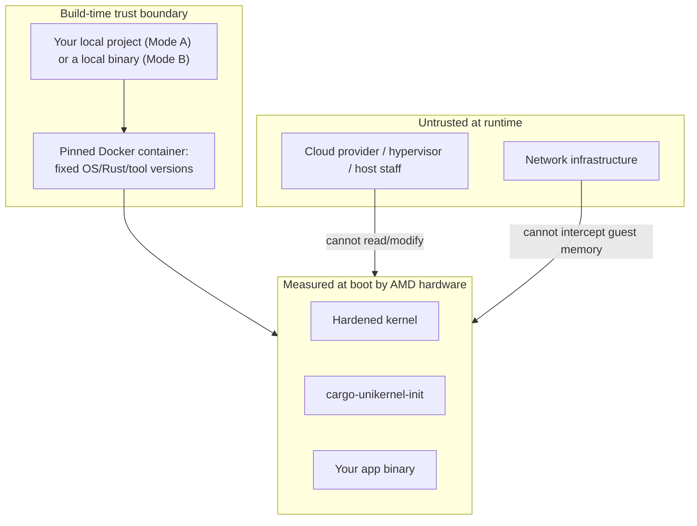

# Threat Model

*[docs index](README.md) · [project README](../README.md)*

**The app is embedded into the image at build time.** Neither the guest nor the build ever
fetches it over the network — the app, and for sev-snp the OVMF firmware, are always local
files. The trust boundary is the build pipeline, the Docker container, and whatever local
path your config points at — never a network fetch.

`casual` is hardened but has no confidential-computing guarantees. `sev-snp` adds a hardware
root of trust: AMD's Secure Processor measures the kernel+initramfs (including your app)
before it ever executes.

## Trust boundary (sev-snp profile)

## Mode A vs Mode B

| | Mode A (`path`) | Mode B (binary) |
|:---|:---|:---|
| Trusted | Your working tree + the build toolchain ([`toolchains.md`](toolchains.md)) | The binary bytes you point at |
| Measurement proves | Compiled from exactly these files | Exactly these bytes — nothing about origin |
| Reproducibility | As good as your working-tree discipline; use a tagged CI release for third-party verification | N/A — integrity is whatever produced the file |

Neither mode involves a network fetch, so there's no TOCTOU gap between what was verified and
what gets measured.

## Threat catalog

### Malicious cloud provider (sev-snp)

| Attack | Mitigation |
|:---|:---|
| Read VM memory | Hardware per-VM encryption key |
| Modify boot image | Secure Processor measures kernel+initramfs+app; any change alters the measurement |
| DMA injection | Reverse Map Table blocks host DMA into encrypted pages |
| Replay old VM state | Attestation includes a version counter |

### Build-time supply chain

| Attack | Mitigation |
|:---|:---|
| Compromised build toolchain | Digest-locked Docker image, pinned Rust, `Cargo.lock` — only as strong as the pin, see [`reproducible_builds.md`](reproducible_builds.md) |
| Malicious `build_command` (generic toolchain) | Runs in the same pinned container; `extra_apt_packages` are Ubuntu-repo only — the command itself isn't audited |
| Accidentally dynamic-linked binary | `readelf` fails the build immediately, naming missing libraries |
| Malicious/wrong OVMF firmware | `preset = "builtin"` is baked in, never fetched; a provider-supplied `path` is local but not verifiable by the tool |
| `cargo unikernel release`'s `gh` call | Standard CI-secret hygiene; generated workflow scopes `contents: write` only |

### Unsolicited network traffic (pre-RCE, both profiles)

| Attack | Mitigation |
|:---|:---|
| Port-scan the guest to find what it runs | `[network.firewall]` (on by default): an nftables `input` chain with `policy drop`, so an unlisted port produces no `RST` and no ICMP unreachable — a scanner sees `filtered`, the same answer a dark address gives. Only the ports in `inbound` reach the stack at all |
| Ping/ICMP-probe for liveness | Echo request is not in the admitted ICMP set, so nothing replies. `icmp_echo_ignore_all=1` (`[hardening.runtime].icmp_hardening`) is the second answer to the same question |
| Reach a port the app opened that the config never mentioned | The filter is an allowlist over ports, not over the app's behaviour: a listener the config doesn't name is unreachable from off-box regardless of what bound it |
| Change the port policy from the host | On sev-snp the policy is baked into the guest image and covered by the launch measurement, so a peer verifying an attestation report verifies the port policy with it — unlike a host-side security group, which the host can edit |
| Reconfigure the filter after an RCE | The app is an unprivileged uid with an empty capability bounding set — no `CAP_NET_ADMIN`, so nf_tables refuses it. With `[network.firewall].enabled = false` the kernel has no netfilter compiled in at all, which is the same answer by removal |

Not covered, and deliberately: the guest still answers ARP and IPv6 neighbour solicitation, because
an address that answers neither is unreachable at L2 — an attacker on the same segment can always
see the guest exists. Outbound traffic is unrestricted by design, so egress destinations and timing
are visible to the network. The kernel's own `ip=dhcp` autoconfiguration runs before PID 1 exists,
so that one exchange predates the filter; nothing is listening yet, but it is not zero.

### Runtime exploitation (post-RCE, both profiles)

| Attack | Mitigation |
|:---|:---|
| Read/write app files | Read-only `/payload`, `noexec` elsewhere, no shell/package manager |
| `ptrace` / debug another process | Seccomp blocks `ptrace`, `process_vm_read`/`write` |
| Remount writable+exec, load a module, kexec | Seccomp blocks both mount APIs, `*_module`, `kexec_*`, `personality` |
| Drop and run a new binary | Every writable mount is `noexec`; `memfd_create`/`memfd_secret` also denied so a file can't dodge the mount flags via `execveat`. Both lift with `[app.runtime.danger].allow_write_execute` |
| Shellcode from `PROT_WRITE\|PROT_EXEC` memory | `PR_SET_MDWE` (`PR_MDWE_REFUSE_EXEC_GAIN`) refuses any `mmap`/`mprotect` that turns a writable mapping executable — closes the anonymous-memory gap the mount-flag/seccomp row above leaves open. Lifts with the same `[app.runtime.danger].allow_write_execute`, since both gate "no writable+executable memory" as one guarantee. Does not affect `execve` itself (the ELF loader maps a new image's text `PROT_EXEC` directly, never via a writable transition) |
| Read files/devices outside the app's own footprint | Landlock (`[app.runtime.landlock]`, on by default): an allowlist over the payload dir, the scratch mounts, `/proc`, the CPU-topology slice of `/sys`, and the basic character devices — everything else, including most of `/sys` and `/dev/vda`, is unreachable regardless of uid or mount flags |
| `ioctl` a device the app has no business touching (sev-snp: `/dev/sev-guest`) | Landlock ABI 5's `IOCTL_DEV` right is granted only on `/dev/sev-guest`, which the driver exposes as `ioctl`-only (no `.read`/`.write`) — no other device node in the ruleset can `ioctl` at all |
| Bypass seccomp via x32 ABI | Filter checks `AUDIT_ARCH_X86_64` and rejects `__X32_SYSCALL_BIT`; `CONFIG_X86_X32_ABI` is off by default too |
| Read PID 1's `/proc` (cmdline = host's kernel cmdline) | `/proc` mounted `hidepid=2`, optionally `subset=pid` (`[hardening.runtime].proc_subset_pid`); PID 1 is `PR_SET_DUMPABLE 0` |
| Exhaust RAM via writable tmpfs | `/tmp`, `/var/tmp`, `/dev/shm` capped at 64 MB, `/run` at 16 MB (not the tmpfs default of half of RAM) |
| Weak keys from an unseeded CRNG | Boot waits up to 30s for seeding, then **powers off** rather than starting unseeded |
| Escape into a new namespace | `CONFIG_NAMESPACES=n` — every `CLONE_NEW*` fails. Seccomp also denies `unshare`/`setns` |
| Read another process's memory sans `ptrace` | `yama ptrace_scope=3`, seccomp denies `process_vm_readv`/`writev`, `CONFIG_PROC_MEM_NO_FORCE=y` |
| Move the clock to revive an expired cert | Seccomp denies clock-setting syscalls — mitigated against the guest; the host still supplies the initial clock, see below |
| Acquire a capability on exec | Capability bounding set unconditionally dropped before exec |
| Privilege escalation | No kernel modules, filesystem lockdown regardless of privilege |
| Persistence across reboot | `ram` mode (default): tmpfs, wiped on reboot. `persistent`: `/var` is real ext4 and survives by design — see below |
| Hostile block device fed to the ext4 parser (`persistent`, sev-snp) | Superblock checked from userspace before mount; unrecognized volumes get wiped rather than parsed. **Weak** — screens accidents, not a determined host |
| Fork bomb / fd exhaustion | `setrlimit` ceilings from `[app.runtime.limits]`, pre-exec, unraiseable by the app |

## Remote attestation is the app's job

This image runs no attestation service. `sev-snp` exposes `/dev/sev-guest` to the app;
fetching a report and proving it to a peer is entirely the app's protocol.

That's deliberate. A generic HTTP endpoint that echoes a caller's nonce as `REPORT_DATA` only
proves "some VM with this measurement is alive" — nothing about the connection the caller
then uses. An attacker terminating the app's real traffic can relay a genuine report from a
genuine guest unchanged; a nonce stops replay, not relay.

Binding the proof to the channel means putting something only the app can speak for in
`REPORT_DATA` (64 bytes; hash if you need more) — the TLS public key, a session ID, a request
hash. **A workable shape:** generate a keypair at startup, set
`REPORT_DATA = SHA-512(peer_nonce ‖ public_key)`, serve report + public key together,
terminate TLS on that key. The peer verifies the report's signature chain, checks the
measurement against one it computed with `cargo unikernel measure`, recomputes the hash from
its nonce and the received key, and only then trusts the channel.

## Persistent storage is outside the sev-snp guarantee

`[storage].mode = "persistent"` attaches a hypervisor virtio-blk device at `/var`. It is
**not encrypted or integrity-checked** — the host can read and modify it between boots
undetected. SEV-SNP's launch measurement covers kernel+initramfs+app at boot, not `/var`'s
contents, which didn't exist yet. Closing this needs `dm-crypt`+`dm-integrity` keyed from
`SNP_GET_DERIVED_KEY`. **Not implemented.** Treat `/var` under `persistent`+sev-snp as
untrusted, host-visible scratch space; keep secrets in RAM.

## What is NOT protected

- **Denial of service** — a cloud provider can always shut down or isolate a VM; SEV-SNP
  protects confidentiality/integrity, not availability.
- **`casual` profile** — hardened, but no confidentiality/integrity guarantee; use `sev-snp`
  if the provider must be outside your trust boundary.
- **Side channels** — some speculative-execution channels may leak across VM boundaries; an
  evolving area independent of this project.
- **AMD hardware backdoor** — an undisclosed silicon backdoor breaks the entire sev-snp trust
  model.
- **Bugs in this code** — `cargo-unikernel-init` is kept small to minimize the surface; the
  kernel uses KSPP hardening regardless of profile.
- **Proving the measurement to a peer** — the image exposes `/dev/sev-guest` and stops there;
  binding a report to your channel is your app's job (above).
- **Wall-clock time** — no secure-time bootstrap; the guest's clock comes from the host, so
  any decision depending on absolute time (cert expiry, token lifetimes) is only as
  trustworthy as the host on sev-snp. Seccomp stops a compromised guest process from moving
  the clock — not the host setting it wrong to begin with.
- **The seccomp layer is a denylist**, not an allowlist — a wrong allowlist would silently
  break every image this tool produces. Where a gap would undermine a guarantee above, that
  guarantee is also backed by a kernel-config decision (`CONFIG_NAMESPACES`,
  `CONFIG_FHANDLE`, `CONFIG_KCMP`), so it isn't carried by one layer alone. Still: a novel
  syscall is allowed until it's added.
- **Whatever you pin** — the tool verifies running code matches the ref/hash you gave it, not
  that the ref/hash itself is trustworthy. It moves the trust question to you; it doesn't
  answer it for you.
- **The console, unless you opt in** — `[app.runtime].console` (app stdio) and `[logging].enabled`
  (this init's own boot/warning output) both default to *off* and are compile-time toggles
  (`app-console`/`logging` features), not runtime flags. On sev-snp the serial console is read
  by the hypervisor, outside the trust boundary — enabling either means accepting that
  whatever it prints reaches an untrusted party.
