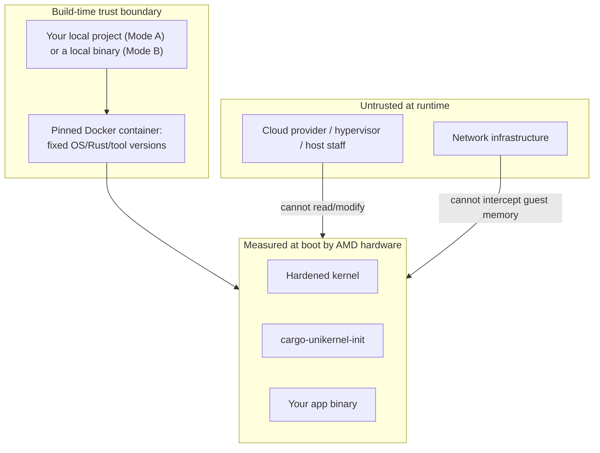

# Threat Model

*[docs index](README.md) · [project README](../README.md)*

**The app binary is embedded into the image at build time.** The guest never fetches it over
the network, and neither does the build itself — the app and (for sev-snp) the OVMF firmware
are always local files, so the trust boundary sits at the build pipeline, the Docker
container, and whatever local path your config points at, never a network fetch.

`casual` has no confidential-computing guarantees — it's a hardened, minimal-attack-surface
image. `sev-snp` adds a hardware root of trust: AMD's Secure Processor measures the
kernel+initramfs (including your app) before it ever executes.

## Trust boundary (sev-snp profile)

## Mode A vs Mode B trust differences

| | Mode A (`path`) | Mode B (binary) |
|:---|:---|:---|
| Trusted | Whatever's on disk now, + the build toolchain (see [`toolchains.md`](toolchains.md)) | The binary bytes you point at |
| Measurement proves | Compiled from exactly these files | Exactly these bytes — nothing about origin |
| Best for | Default "drop this in my project" flow | Quick starts, polyglot apps |
| Reproducibility | Only as good as your working-tree discipline — use a tagged CI release for third-party verification | N/A — integrity is whatever produced the file on disk, not a build |

Neither mode involves a network fetch, so there's no TOCTOU gap between what was verified
(`cargo build`, or the file already sitting on disk) and what's baked into the image and
measured.

## Threat catalog

### Malicious cloud provider (sev-snp)

| Attack | Mitigation | Status |
|:---|:---|:---|
| Read VM memory | SEV-SNP encrypts guest memory with a hardware per-VM key | Mitigated |
| Modify boot image | Secure Processor measures kernel+initramfs+app; any change alters the measurement | Mitigated |
| DMA injection | SEV-SNP Reverse Map Table blocks host DMA into encrypted pages | Mitigated |
| Replay old VM state | Attestation includes a version counter | Mitigated |

### Build-time supply chain

| Attack | Mitigation | Status |
|:---|:---|:---|
| Compromised build toolchain | Pinned Docker image (digest-locked), pinned Rust version, `Cargo.lock` | Mitigated, only as strong as the pin — see [`reproducible_builds.md`](reproducible_builds.md) |
| `toolchain = "generic"` pulls in something malicious | Runs in the same pinned container; `extra_apt_packages` are Ubuntu-repo only | Only as strong as your own `build_command` — not audited |
| Accidentally dynamically-linked binary | `readelf` fails the build immediately, naming missing libraries | Mitigated — a correctness class, not an exploit |
| Malicious/wrong OVMF firmware | `preset = "builtin"` is baked into the CLI, never fetched; a provider-supplied `path` is always a local file, but a wrong one isn't detectable | Only as strong as the source you trust |
| `cargo unikernel release`'s `gh` invocation | Runs with whatever `gh auth`/CI token scope is available | Standard CI-secret hygiene; workflow scopes `contents: write` only |

### Runtime exploitation (both profiles)

| Attack | Mitigation | Status |
|:---|:---|:---|
| RCE in your app | Read-only `/payload`, `noexec` elsewhere by default, no shell/package manager | Mitigated |
| Post-RCE: `ptrace`/debug another process | Seccomp denylist blocks `ptrace`/`process_vm_read`/`write` | Mitigated |
| Post-RCE: remount writable+exec, load a module, kexec, defeat ASLR | Seccomp blocks `mount`/`umount2`/`pivot_root` **and the mount(2)-free mount API** (`fsopen`/`fsconfig`/`fsmount`/`move_mount`/`open_tree`/`mount_setattr`), `*_module`, `kexec_*`, `personality` | Mitigated |
| Post-RCE: drop and run a new binary | Every writable mount is `noexec`, **and `memfd_create`/`memfd_secret` are seccomp-denied** so an anonymous in-memory file can't be `execveat`'d past the mount flags. Both are lifted by `[app.runtime.danger].allow_write_execute` | Mitigated by default; opt-out is named to be hard to enable by accident |
| Post-RCE: run shellcode from anonymous `PROT_WRITE\|PROT_EXEC` memory | Nothing — `mmap`/`mprotect` protection flags are not filtered, because doing so breaks JITs and several allocators | **Not mitigated.** The row above is about running a new *program image*; W^X within the app's own address space is not a property this image provides |
| Post-RCE: bypass the seccomp filter via the x32 ABI | The filter checks `AUDIT_ARCH_X86_64` and separately rejects syscall numbers carrying `__X32_SYSCALL_BIT`; `CONFIG_X86_X32_ABI` is also off by default | Mitigated at both layers, so re-enabling the kconfig doesn't silently forfeit the denylist |
| Post-RCE: read PID 1's `/proc` entries (its cmdline is the host's kernel command line) | `/proc` is mounted `hidepid=2`; PID 1 is additionally `PR_SET_DUMPABLE 0` | Mitigated |
| Exhaust guest RAM through a writable tmpfs | `/tmp`, `/var/tmp` and `/dev/shm` are capped at 64 MB each and `/run` at 16 MB, rather than tmpfs's default of half of RAM | Mitigated |
| Weak keys from an unseeded CRNG | Boot blocks up to 30s for the kernel to report the CRNG seeded, and **powers the guest off** rather than starting the app without it | Mitigated |
| Post-RCE: escape into a new namespace | `CONFIG_NAMESPACES=n` — every `CLONE_NEW*` flag returns `EINVAL` regardless of syscall. Seccomp additionally denies `unshare`/`setns` (it cannot deny `clone`/`clone3`, which threads need) | Mitigated |
| Post-RCE: read another process's memory without `ptrace` | `yama ptrace_scope=3`, seccomp denies `process_vm_readv`/`writev`, `CONFIG_PROC_MEM_NO_FORCE=y` blocks `FOLL_FORCE` writes through `/proc/<pid>/mem` | Mitigated |
| Post-RCE: move the clock to revive an expired/revoked certificate | Seccomp denies `settimeofday`/`clock_settime`/`clock_adjtime`/`adjtimex` | Mitigated against the guest; the host still supplies the initial clock, see below |
| Post-RCE: acquire a capability on exec | Capability bounding set unconditionally dropped before exec | Mitigated |
| Privilege escalation | No kernel modules (`CONFIG_MODULES=n`), filesystem lockdown regardless of privilege | Mitigated |
| Persistence across reboot | `ram` mode (default): tmpfs, wiped on reboot. `persistent` mode: `/var` is real disk-backed ext4, survives reboots by design — see the dedicated section below | Mitigated by default; opt-in trade-off with persistent storage |
| Hostile block device fed to the in-kernel ext4 parser (`persistent`, sev-snp) | The device's superblock is read from userspace *before* any mount, so a device that isn't recognizably this image's is wiped rather than parsed by the kernel. The marker is a volume label the host can copy, so this screens unrecognized images, not hostile ones | **Weak.** Bounds which images reach the parser by accident; a host that wants its ext4 metadata parsed inside the TCB can still arrange it |
| Fork bomb / fd/memory exhaustion | `setrlimit` ceilings from `[app.runtime.limits]`, applied pre-exec; app holds no capability to raise them | Mitigated (memory ceiling opt-in) |

## Remote attestation is the app's job

This image runs no attestation service. The `sev-snp` profile compiles in `/dev/sev-guest` and
the guest init chmods it into the app's reach; fetching a report and proving it to a peer is
entirely the app's protocol.

That's deliberate, not a gap left unfilled. Earlier versions shipped a generic HTTP endpoint
that echoed a caller's nonce as `REPORT_DATA` and returned the signed report — which proves
only "some VM with this measurement is alive," nothing about the connection the caller then
uses. An attacker terminating the app's real traffic can fetch a genuine report from a genuine
guest and relay it unchanged; the nonce stops replay, not relay.

Binding the proof to the channel means putting something only the app can speak for in
`REPORT_DATA` (64 bytes; hash if you need more than one thing) — the public key its TLS
terminates on, a session identifier, a request hash. Which one is right depends on the app's
own protocol, which is why this can't live in a generic server.

**A workable shape:** generate a keypair at startup, set
`REPORT_DATA = SHA-512(peer_nonce ‖ public_key)`, serve the report and public key together,
terminate TLS on that key. The peer checks the report's signature chain, checks the measurement
against one it computed with `cargo unikernel measure`, recomputes the `REPORT_DATA` hash from
its nonce and the key it received, and only then trusts the channel.

## Persistent storage is outside the sev-snp guarantee

`[storage].mode = "persistent"` attaches a hypervisor-supplied virtio-blk device at `/var`. It
is **not encrypted and not integrity-checked**: the host can read everything written there, and
modify it between boots undetected. SEV-SNP protects guest *memory*; a report covers the launch
measurement of kernel+initramfs+app, not `/var`'s contents, which didn't exist at launch.

Closing this properly means `dm-crypt` + `dm-integrity`, keyed from an `SNP_GET_DERIVED_KEY`
secret bound to the launch measurement. **Not implemented.** Until it is, treat `/var` under
`persistent` + sev-snp as untrusted, host-visible scratch space, and keep secrets in RAM.

## What is NOT protected

- **Denial of service** — a cloud provider can always shut down or network-isolate a VM;
  SEV-SNP protects confidentiality/integrity, not availability.
- **`casual` profile has no confidentiality/integrity guarantees** — it's hardened, not
  confidential-computing. Use `sev-snp` if the provider itself must be outside your trust
  boundary.
- **Side-channel attacks** — some speculative-execution channels may leak across VM
  boundaries; an evolving area independent of this project.
- **AMD hardware backdoor** — an undisclosed silicon backdoor breaks the entire sev-snp trust
  model, the fundamental hardware assumption.
- **Bugs in this code** — `cargo-unikernel-init` is kept small to minimize this; the kernel
  uses KSPP hardening regardless of profile.
- **Proving the measurement to a peer** — the image exposes `/dev/sev-guest` and stops there.
  Binding a report to the channel your app serves is your app's job; see the section above for
  why that cannot be done generically.
- **Wall-clock time** — there is no secure-time bootstrap. The clock the guest starts with
  comes from the host, so any app decision that depends on absolute time (certificate expiry,
  revocation freshness, token lifetimes) is only as trustworthy as the host on the sev-snp
  profile. Seccomp stops a *compromised guest process* from moving the clock; nothing here
  stops the host from setting it wrong to begin with.
- **The seccomp layer is a denylist** — it names syscalls with no legitimate use in a
  single-purpose server rather than enumerating the ones an app may make, because a wrong
  allowlist silently breaks every image this tool produces. Where a gap in it would undermine
  a guarantee claimed above, that guarantee is backed by a kernel-config decision as well
  (`CONFIG_NAMESPACES`, `CONFIG_FHANDLE`, `CONFIG_KCMP`), so neither layer is load-bearing
  alone. It remains a denylist, and a novel syscall is allowed until it is listed.
- **Whatever you pin** — the tool verifies the running code matches the ref/hash you gave it,
  not that the ref/hash itself is trustworthy. It moves the trust question somewhere you
  control; it doesn't answer it for you.
