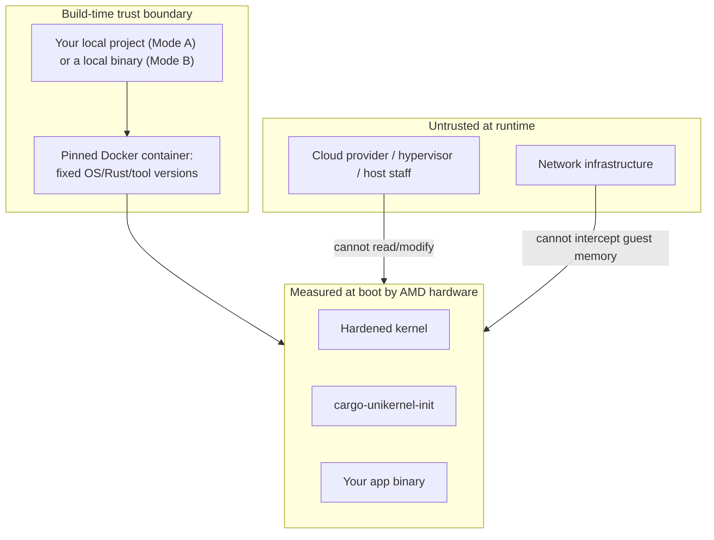

# Threat Model

*[docs index](README.md) · [project README](../README.md)*

**The app binary is embedded into the image at build time.** The guest never fetches it over
the network, and neither does the build itself — the app and (for sev-snp) the OVMF firmware
are always local files, so the trust boundary sits at the build pipeline, the Docker
container, and whatever local path your config points at, never a network fetch. See
[`init_security.md`](init_security.md) for why build-time embedding closes the TOCTOU gap a
runtime fetch would open.

`casual` has no confidential-computing guarantees — it's a hardened, minimal-attack-surface
image. `sev-snp` adds a hardware root of trust: AMD's Secure Processor measures the
kernel+initramfs (including your app) before it ever executes.

## Trust boundary (sev-snp profile)

## Mode A vs Mode B trust differences

| | Mode A (`path`) | Mode B (binary) |
|:---|:---|:---|
| Trusted | Whatever's on disk now, + the build toolchain (see [`toolchains.md`](toolchains.md)) | The binary bytes you point at |
| Measurement proves | Compiled from exactly these files | Exactly these bytes — nothing about origin |
| Best for | Default "drop this in my project" flow | Quick starts, polyglot apps |
| Reproducibility | Only as good as your working-tree discipline — use a tagged CI release for third-party verification | N/A — integrity is whatever produced the file on disk, not a build |

Neither mode involves a network fetch, so there's no TOCTOU gap between what was verified
(`cargo build`, or the file already sitting on disk) and what's baked into the image and
measured.

## Threat catalog

### Malicious cloud provider (sev-snp)

| Attack | Mitigation | Status |
|:---|:---|:---|
| Read VM memory | SEV-SNP encrypts guest memory with a hardware per-VM key | Mitigated |
| Modify boot image | Secure Processor measures kernel+initramfs+app; any change alters the measurement | Mitigated |
| DMA injection | SEV-SNP Reverse Map Table blocks host DMA into encrypted pages | Mitigated |
| Replay old VM state | Attestation includes a version counter | Mitigated |

### Build-time supply chain

| Attack | Mitigation | Status |
|:---|:---|:---|
| Compromised build toolchain | Pinned Docker image (digest-locked), pinned Rust version, `Cargo.lock` | Mitigated, only as strong as the pin — see [`reproducible_builds.md`](reproducible_builds.md) |
| `toolchain = "generic"` pulls in something malicious | Runs in the same pinned container; `extra_apt_packages` are Ubuntu-repo only | Only as strong as your own `build_command` — not audited |
| Accidentally dynamically-linked binary | `readelf` fails the build immediately, naming missing libraries | Mitigated — a correctness class, not an exploit |
| Malicious/wrong OVMF firmware | `preset = "builtin"` is baked into the CLI, never fetched; a provider-supplied `path` is always a local file, but a wrong one isn't detectable | Only as strong as the source you trust |
| `cargo-unikernel release`'s `gh` invocation | Runs with whatever `gh auth`/CI token scope is available | Standard CI-secret hygiene; workflow scopes `contents: write` only |

### Runtime exploitation (both profiles)

| Attack | Mitigation | Status |
|:---|:---|:---|
| RCE in your app | Read-only `/payload`, `noexec` elsewhere by default, no shell/package manager | Mitigated |
| Post-RCE: `ptrace`/debug another process | Seccomp denylist blocks `ptrace`/`process_vm_read`/`write` | Mitigated |
| Post-RCE: remount writable+exec, load a module, kexec, defeat ASLR | Seccomp blocks `mount`/`umount2`/`pivot_root`, `*_module`, `kexec_*`, `personality` | Mitigated |
| Post-RCE: drop and run a new binary | Every writable mount is `noexec` unless `[app.runtime.danger].allow_write_execute` is set | Mitigated by default; opt-out is named to be hard to enable by accident |
| Post-RCE: acquire a capability on exec | Capability bounding set unconditionally dropped before exec | Mitigated |
| Privilege escalation | No kernel modules (`CONFIG_MODULES=n`), filesystem lockdown regardless of privilege | Mitigated |
| Persistence across reboot | `ram` mode (default): tmpfs, wiped on reboot. `persistent` mode: `/var` is real disk-backed ext4, survives reboots by design, and (sev-snp) sits outside SEV-SNP's memory encryption — a plain virtio-blk device the hypervisor can read/tamper with | Mitigated by default; opt-in trade-off with persistent storage |
| Fork bomb / fd/memory exhaustion | `setrlimit` ceilings from `[app.runtime.limits]`, applied pre-exec; app holds no capability to raise them | Mitigated (memory ceiling opt-in) |
| Flooding the attestation endpoint | Fixed worker pool, separate firmware-call counter, per-subnet rate/concurrency limits — see [`attestation_api.md`](attestation_api.md) | Mitigated against any single subnet, not a large distributed flood |

## What is NOT protected

- **Denial of service** — a cloud provider can always shut down or network-isolate a VM;
  SEV-SNP protects confidentiality/integrity, not availability.
- **`casual` profile has no confidentiality/integrity guarantees** — it's hardened, not
  confidential-computing. Use `sev-snp` if the provider itself must be outside your trust
  boundary.
- **Side-channel attacks** — some speculative-execution channels may leak across VM
  boundaries; an evolving area independent of this project.
- **AMD hardware backdoor** — an undisclosed silicon backdoor breaks the entire sev-snp trust
  model, the fundamental hardware assumption.
- **Bugs in this code** — `cargo-unikernel-init` is kept small to minimize this; the kernel
  uses KSPP hardening regardless of profile.
- **Whatever you pin** — the tool verifies the running code matches the ref/hash you gave it,
  not that the ref/hash itself is trustworthy. It moves the trust question somewhere you
  control; it doesn't answer it for you.
